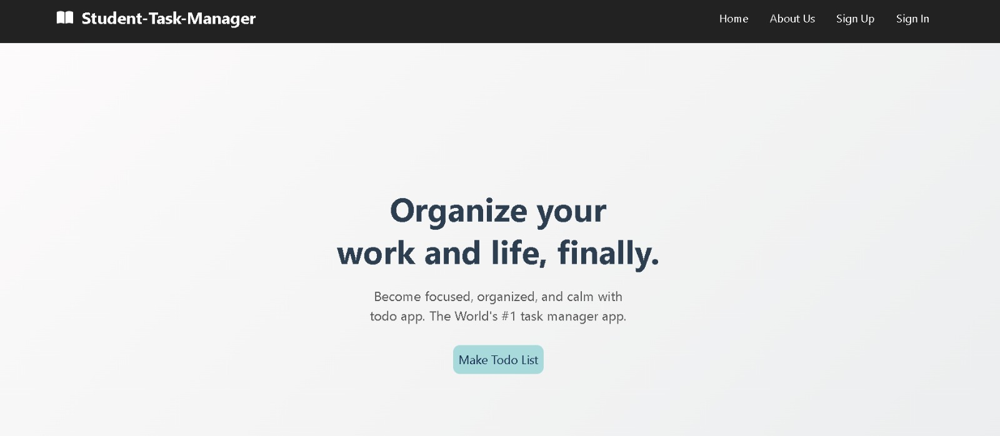
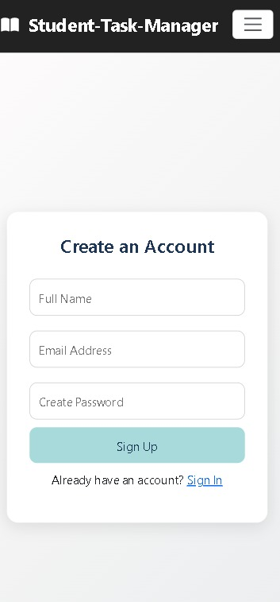
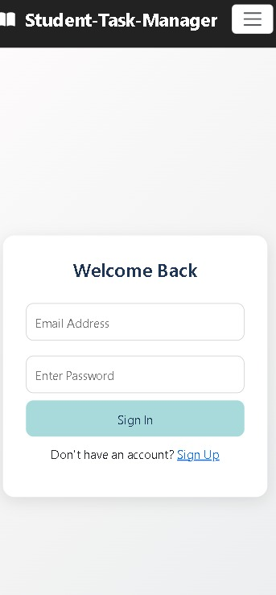
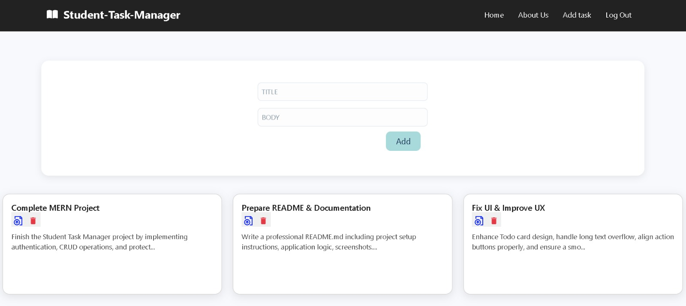
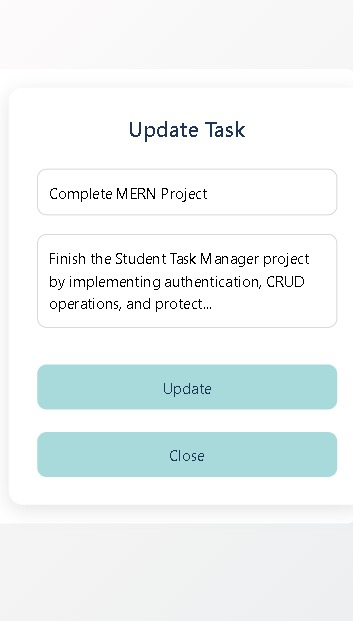

# Student Task Manager

A full-stack student task management application that allows users to securely sign up, sign in, and manage their daily tasks using the MERN stack.

## 📝 1. Project Title & Goal

**Student Task Manager** is a full-stack Todo application that enables users to create, update, and delete personal tasks after authentication, helping students stay organized and productive.

## ⚙️ 2. Setup Instructions

### 🔧 Backend Setup
cd backend
npm install
npm start

Backend runs on:
http://localhost:2000

### Frontend Setup
cd frontend
cd client
npm install
npm run dev

Frontend runs on:
http://localhost:5173

Environment Requirements
Node.js (v18 or higher)
MongoDB (Local or MongoDB Atlas)
npm

🧠 3. The Logic (How I Thought)
🔍 Why did I choose this approach?

Used React + Redux to manage authentication state globally.

Implemented protected routes logic so users must sign in before accessing tasks.

Used MongoDB + Express for flexible, scalable data storage.

Each task is linked to a userId, ensuring users can only see their own tasks.

Used React Hooks (useState, useEffect) for clean and efficient state handling.

🐛 Hardest Bug Faced & How I Fixed It

Problem Faced:
Update and Delete buttons were not working correctly.

Clicking update sometimes affected the wrong task.

Long titles and descriptions caused UI breakage and hidden buttons.

How I Fixed It:
Stored selectedTask using the task _id, not array index.

Used Array.find() to fetch the correct task during updates.

Fixed UI issues using CSS:

overflow-wrap: break-word

Fixed-height cards

Flexbox layout for action buttons

Removed unnecessary icon borders

Result:

Update and Delete work reliably.

UI remains stable even with long content.

Buttons are always visible and clickable.

4. 📸 Output Screenshots

### 🏠 Home Page

### 📝 Sign Up Page

### 🔐 Sign In Page

### 📋 Todo Dashboard

### ℹ️ About Page

### ℹ️ Update Page

🚀 5. Future Improvements

If I had 2 more days, I would:

🔒 Implement JWT authentication with token expiration

📱 Improve mobile responsiveness

🗂 Add task categories and priority levels

⏰ Add due dates and reminders

🌙 Implement dark mode

🚀 Deploy the app using Vercel (Frontend) and Render (Backend)

✅ Tech Stack
Frontend
React
Redux
React Router
CSS

Backend
Node.js
Express
Database
MongoDB
Authentication
Redux + LocalStorage
UI & Icons
React Icons

👩‍💻 Author

Vanshita Gupta
Student | Full Stack Developer
